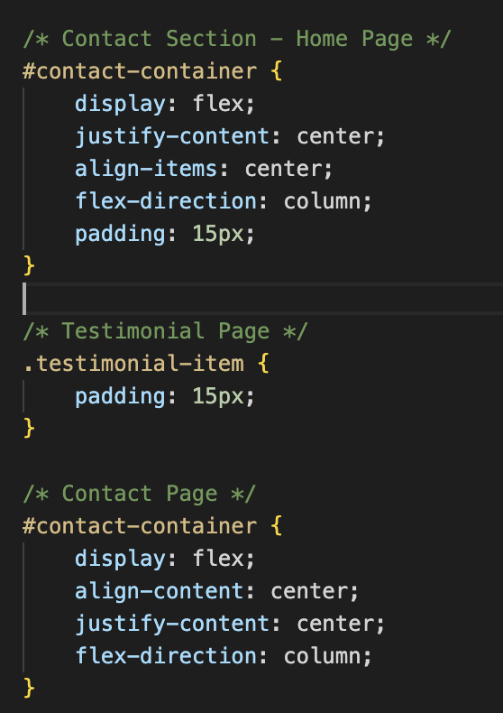
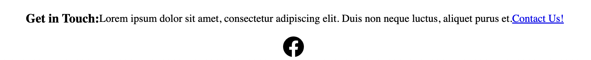
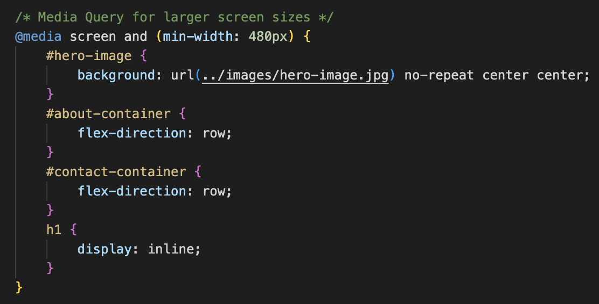
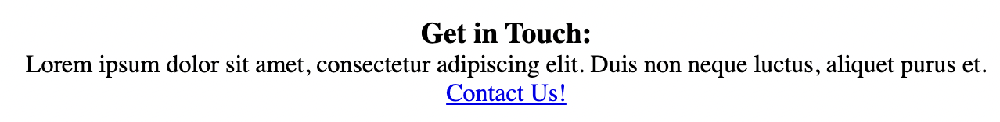
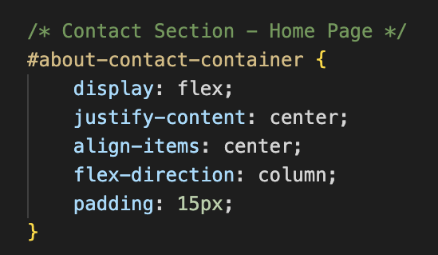

# Mobile Physio README

## Contents
* [User Experience](#user-experience)
* [Design](#design)
* [Features](#features)
* [Technologies Used](#technologies-used)
* [Deployment & Local Development](#deployment--local-development)
* [Testing](#testing)
* [Credits](#credits)

## User Experience

## Design

## Features

## Technologies Used

## Deployment & Local Development

## Testing
### Bugs:
About page, contact section uses the same id as the main contact section div.

## Credits